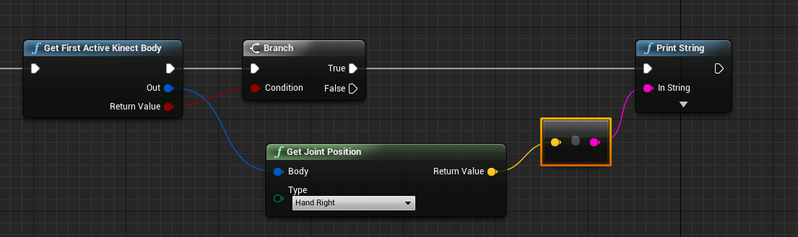

# FLKinectPlugin - Kinect Integration Plugin for Unreal Engine 4.9

This plugin exposes all tracked bodies to Unreal Engine 4.9.

## Usage

Drop the plugin in your project's `\Plugins` folder. When you recompile, "Kinect" will appear as a cateogry in your blueprints.

If you're testing, you can just use "Get First Body":

Kinect 2 allows up to 6 bodies tracked, you can see which ones are tracked through the blueprint:

## Changelog

**0.2.3**

Moves Kinect Types to a public path.

**0.2.2**

Fixes issue with how orientations are drawn.

**0.2.1**

Adds "Debug" features.

**0.2.0**

Removes the kinect component, all features now governed by a static library.

**0.1**

Initial commit

## License
The code in this repository is available under the [MIT License](https://secure.wikimedia.org/wikipedia/en/wiki/Mit_license).

The MIT License (MIT) Copyright (c) 2016 Fake Love Inc.

Permission is hereby granted, free of charge, to any person obtaining a copy of this software and associated documentation files (the "Software"), to deal in the Software without restriction, including without limitation the rights to use, copy, modify, merge, publish, distribute, sublicense, and/or sell copies of the Software, and to permit persons to whom the Software is furnished to do so, subject to the following conditions:

The above copyright notice and this permission notice shall be included in all copies or substantial portions of the Software.

THE SOFTWARE IS PROVIDED "AS IS", WITHOUT WARRANTY OF ANY KIND, EXPRESS OR IMPLIED, INCLUDING BUT NOT LIMITED TO THE WARRANTIES OF MERCHANTABILITY, FITNESS FOR A PARTICULAR PURPOSE AND NONINFRINGEMENT. IN NO EVENT SHALL THE AUTHORS OR COPYRIGHT HOLDERS BE LIABLE FOR ANY CLAIM, DAMAGES OR OTHER LIABILITY, WHETHER IN AN ACTION OF CONTRACT, TORT OR OTHERWISE, ARISING FROM, OUT OF OR IN CONNECTION WITH THE SOFTWARE OR THE USE OR OTHER DEALINGS IN THE SOFTWARE.
